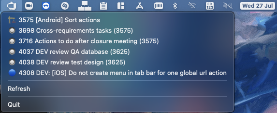

# azure-devops-status-bar
[](https://github.com/mesopelagique/azure-devops-status-bar/actions/workflows/build.yml)
[](https://github.com/mesopelagique/azure-devops-status-bar/actions/workflows/release.yml)
[![release][release-shield]][release-url]

 Status menu bar to show azure devops work items



ie. reproduce the [Open Recent Databases menu](https://doc.4d.com/4Dv18R6/4D/18-R6/Connecting-to-a-4D-Server-Database.300-5360760.en.html) of 4D but for all versions and without an already opened 4D app


## Install

Get it from latest [release](https://github.com/mesopelagique/azure-devops-status-bar/releases/latest/download/azure-devops-status-bar.app.zip) and move it to your `/Applications` folder.

or use one line command in terminal to download and install it.

```bash
curl -sL https://mesopelagique.github.io/azure-devops-status-bar/install.sh | bash
```

## Setup

In menu choose setting to enter your credentials as follow

```
user@mail:personal access token
```

[personal access token](https://docs.microsoft.com/en-us/azure/devops/organizations/accounts/use-personal-access-tokens-to-authenticate?view=azure-devops&tabs=Windows)

### to use with custom organisation and project on azure

edit code in Favorites


## Start at login?

Go to system preferences, `User & Groups`, select your user and the `Login Items` tab. Add here the app with `+`

## ⚠️ “azure-devops-status-bar.app” cannot be opened because the developer cannot be verified.

If you download the app in github release, the app is not signed. 

To open the first time you must right click on the app file then do `Open`, and `Open` again.

<!-- MARKDOWN LINKS & IMAGES -->
<!-- https://www.markdownguide.org/basic-syntax/#reference-style-links -->
[release-shield]: https://img.shields.io/github/v/release/mesopelagique/azure-devops-status-bar
[release-url]: https://github.com/mesopelagique/azure-devops-status-bar/releases/latest
